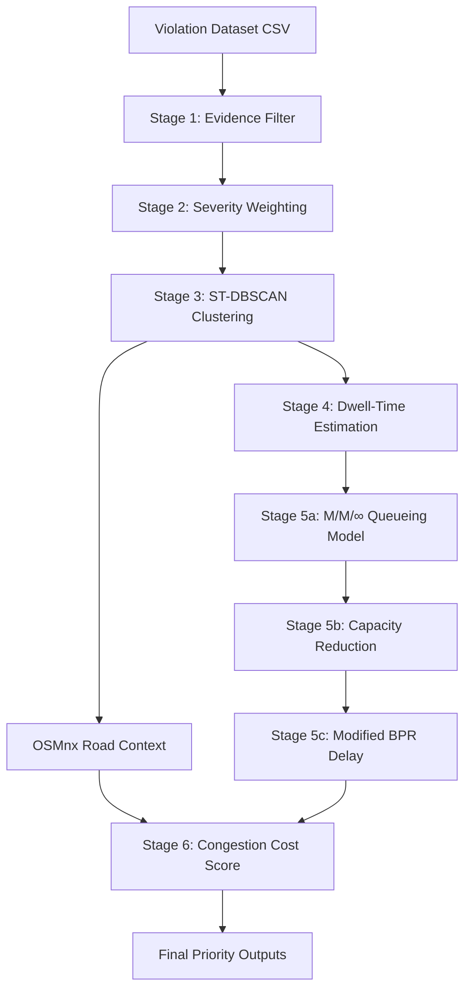
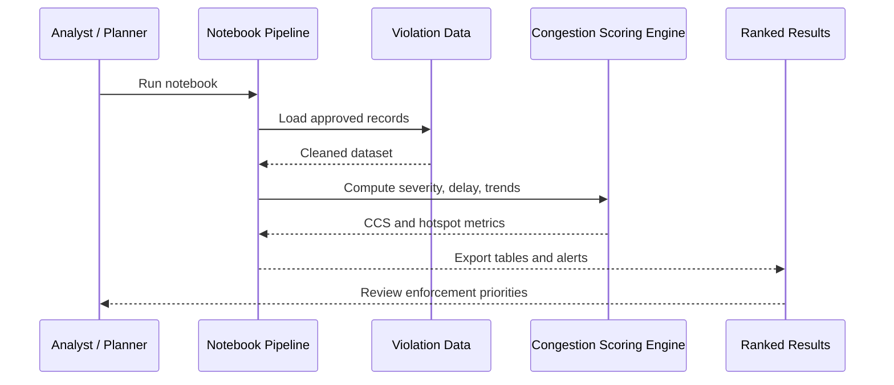
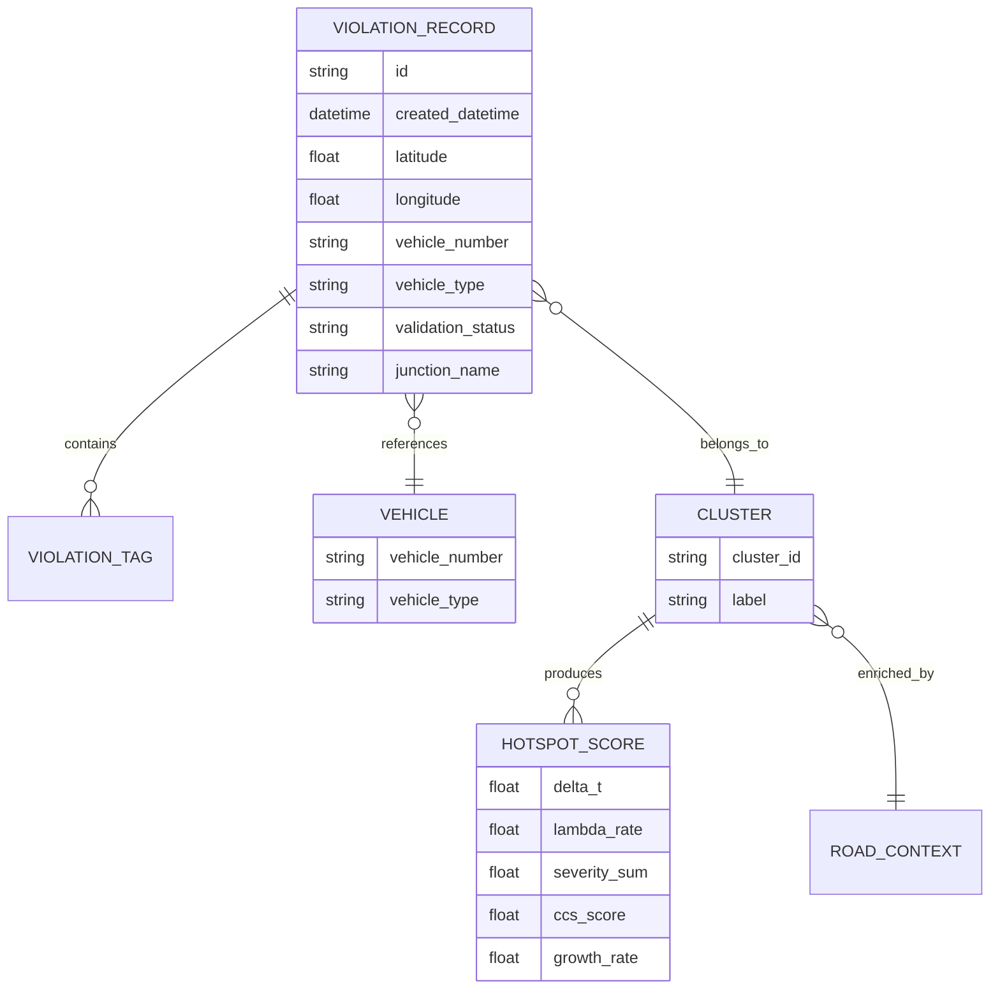

# Poor Visibility on Parking-Induced Congestion

## Overview

This project tackles a practical urban mobility problem: identifying where illegal parking causes the highest congestion impact and where enforcement teams should act first. Rather than ranking zones only by raw violation count, the workflow combines approved records, spatial-temporal clustering, dwell-time reasoning, capacity modeling, and network context to estimate a congestion-aware priority score.

The result is a data-driven framework that helps convert parking violation logs into actionable enforcement insight.

## Problem Statement

On-street illegal parking near commercial zones, metro stations, and event venues reduces lane capacity, disrupts traffic flow, and increases delay. In many cases, enforcement is still reactive and based on intuition rather than measurable impact.

The key question this project addresses is:

> How can illegal parking hotspots be detected and ranked by their actual contribution to congestion so that enforcement resources can be prioritized efficiently?

## Objectives

- Detect recurring spatial-temporal hotspot patterns.
- Filter the dataset to use only reliable approved records.
- Estimate the severity of different parking violations.
- Quantify congestion impact using queueing and capacity models.
- Highlight emerging zones that are growing quickly even if they are not yet large.
- Support weekly or periodic enforcement planning.

## Dataset

The project is based on the provided parking violation dataset.

- Dataset source: [Hackerearth dataset](https://uc.hackerearth.com/he-public-ap-south-1/jan%20to%20may%20police%20violation_anonymized791b166.csv)
- Notebook used: `AI_Parking_violation.ipynb`
- Primary input file referenced in the notebook: `jan to may police violation_anonymized791b166.csv`

## Key Features

- Approved-record filtering for cleaner evidence.
- Violation severity scoring based on road impact.
- ST-DBSCAN-based clustering for hotspot detection.
- Data-derived dwell-time estimation from repeat vehicle patterns.
- Queueing and capacity-based congestion estimation.
- OSMnx / road-network context enrichment.
- Trend acceleration analysis for emerging zones.
- Ranked outputs suitable for dispatch planning.

## Tech Stack

- **Language:** Python
- **Core libraries:** pandas, NumPy, Matplotlib
- **Analysis / modeling:** ST-DBSCAN, queueing and capacity formulas, scoring logic
- **Geospatial context:** OSMnx, NetworkX
- **Environment:** Jupyter Notebook / VS Code notebook workflow
- **Outputs:** CSV summaries and ranked tables

## Architecture

The project follows a multi-stage pipeline that transforms raw violation data into congestion-aware hotspot rankings.



## System Design

The notebook workflow is organized as follows:

1. Load and validate the violation dataset.
2. Filter records with reliable approval status.
3. Map violation types to severity levels.
4. Cluster records by space and time.
5. Estimate vehicle dwell time using repeat-event patterns.
6. Compute congestion impact using queueing and road-capacity methods.
7. Generate a final congestion cost score and ranking.

## Main Process Flow



## Data Model (Conceptual)




## Installation

1. Clone the repository:

   ```bash
   git clone <TODO-repository-url>
   cd <TODO-project-folder>
   ```

2. Create and activate a virtual environment:

   ```bash
   python -m venv venv
   source venv/bin/activate      # macOS / Linux
   venv\Scripts\activate         # Windows
   ```

3. Install dependencies:

   ```bash
   pip install pandas numpy matplotlib jupyter osmnx networkx
   ```

4. Start the notebook environment:

   ```bash
   jupyter notebook
   ```

## Configuration

The core settings are controlled through notebook variables and output paths.

Typical configuration items include:

- Input CSV path
- Output directory for generated artifacts
- Severity mapping rules
- Clustering parameters
- Time-window settings for trend analysis

Example configuration snippet:

```python
INPUT_CSV = "jan to may police violation_anonymized791b166.csv"
OUT_DIR = "phase1_outputs_1"
TOP_N = 25
```

## Usage

Run the notebook cells from top to bottom to:

1. Load the violation data.
2. Filter approved records.
3. Assign violation severity scores.
4. Generate spatial-temporal clusters.
5. Estimate dwell time and delay impact.
6. Produce hotspot rankings and trend alerts.

The outputs can be used by analysts and planners to review the highest-priority zones for enforcement.


## Security Considerations

- Use only approved and validated records for ranking logic.
- Handle vehicle identifiers and location data responsibly.
- Avoid sharing raw datasets publicly unless permission is granted.
- If a web API is added later, secure endpoints and restrict access to authorized users.

## Testing

This project is currently validated mainly through notebook execution and output verification.

Recommended checks:

- Re-run the notebook from the first cell to the end.
- Confirm filtering logic produces expected approved-record counts.
- Verify that outputs match the expected schema.
- Compare ranking outputs for consistency after changes.

## Deployment

The current project is designed for reproducible analysis rather than a full production deployment.

A placeholder deployment URL is included for future hosting:

- Deployment URL: `https://your-deployment-url.example.com`

## Results / Screenshots

The repository contains generated outputs under the `content/` directory which is uploaded as zip folder in 'Traffic_Intelligence_All_Phases (1).zip' and several submission artifacts in the project root. These outputs can be used to inspect how the data pipeline evolves and how zone rankings are derived.

## Limitations

- The workflow depends on the quality and completeness of the provided dataset.
- Some formulas rely on research based modeling choices.
- OSMnx enrichment depends on network access and external map data availability.
- The project is currently analytical and notebook-oriented rather than a deployed service.

## Future Scope

- Build an interactive dashboard for hotspot visualization.
- Expose a REST API for rank retrieval and report generation.
- Add automated scheduled updates for weekly scoring.
- Integrate additional datasets for validation and forecasting.
- Add CI/CD checks for notebook reproducibility.

